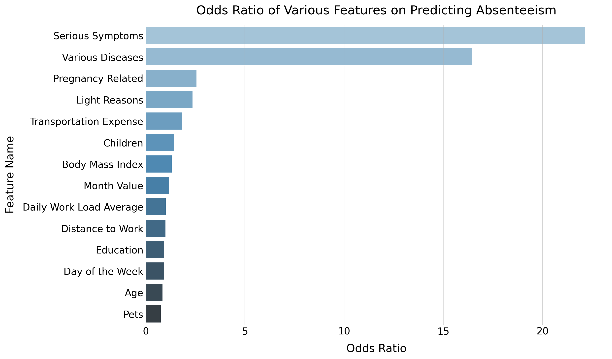

# Absenteeism as Work Analysis

In this project, we will analyze the absenteeism data from the UCI Machine Learning Repository [found here](https://archive.ics.uci.edu/ml/datasets/Absenteeism+at+work).

The database was created with records of absenteeism at work from July 2007 to July 2010 at a courier company in Brazil.  

We will define absenteeism as follows:  
* absence from work during normal working hours resulting in temporary incapacity to execute regular working activity

In this analysis, we will be trying to answer one primary question:  
**Which factors are most indicative of excessive absenteeism from work and can we predict absenteeism by identifying these factors?**

While answering this question, we will also be making use of logistic regression in order to create a model which can predict absenteeism. 

By answering this question and creating our model, we will be able to predict the absenteeism rate for any given employee, which will help us maximize the quantity and quality of work done. 

Some visualizations shown will be created using Tableau.

---

<h2 align="center">Which factors are most indicative of excessive absenteeism from work and can we predict absenteeism by identifying these factors?</h2>
<h3 align="center">
<b>Plot 1:</b> Barplot showing the odds ratios of the various analyzed features in predicting absenteeism. 
</h3>

We can see that 'Serious Symptoms', has an odds ratio of more than 22, suggesting that the model found that serious symptoms are the most important factor in determining absenteeism time, and as a result, it places the greatest weight with 'Serious Symptoms'.  
In fact, a person with serious symptoms is 22 times more likely to be absent than baseline. 
It is also worth noting that 'Various Diseases', is just behind serious symptoms and that there is a steep drop off in terms of importance after these two.  
With that, it's interesting to note that pregnancy and childbirth—which are typically thought to be a leading cause of absenteeism—are significant factor in absenteeism time, but not nearly as important as reasons 3 and 1. 

---

