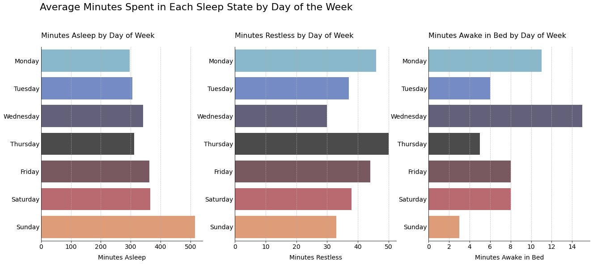

<h1 style="color:#FA8072">Bellabeat Case Study</h1>
<!-- jupyter nbconvert bellabeat_analysis.ipynb --to markdown --output output.md -->

<h3 style="color:#FA8072">Table of Contents</h3>

* [1. Introduction](#Introduction)
* [2. Ask Phase](#Ask-Phase)
* [3. Prepare Phase](#Prepare-Phase)
* [4. Process Phase](#Process-Phase)
* [5. Analyze and Share Phase](#Analyze-and-Share-Phase)
* [6. Act Phase](#Act-Phase)

<a name='Introduction'></a><h3 style="color:#FA8072">1. Introduction:</h3>

introduction text here

<a name='Ask-Phase'></a><h3 style="color:#FA8072">2. Ask Phase:</h3>

ask phase text here

<a name='Prepare-Phase'></a><h3 style="color:#FA8072">3. Prepare Phase:</h3>

<a name='Process-Phase'></a><h3 style="color:#FA8072">4. Process Phase:</h3>

<a name='Analyze-and-Share-Phase'></a><h3 style="color:#FA8072">5. Analyze and Share Phase:</h3>

<a name='Act-Phase'></a><h3 style="color:#FA8072">6. Act Phase:</h3>


```python
import numpy as np
import pandas as pd
import matplotlib.pyplot as plt
import seaborn as sns
import os
```


```python
os.listdir(r'C:\Users\fahmi\Documents\Portfolio\Large Files\Data_Fitbase')
```


    ['dailyActivity_merged.csv',
     'dailyCalories_merged.csv',
     'dailyIntensities_merged.csv',
     'dailySteps_merged.csv',
     'heartrate_seconds_merged.csv',
     'hourlyCalories_merged.csv',
     'hourlyIntensities_merged.csv',
     'hourlySteps_merged.csv',
     'minuteCaloriesNarrow_merged.csv',
     'minuteCaloriesWide_merged.csv',
     'minuteIntensitiesNarrow_merged.csv',
     'minuteIntensitiesWide_merged.csv',
     'minuteMETsNarrow_merged.csv',
     'minuteSleep_merged.csv',
     'minuteStepsNarrow_merged.csv',
     'minuteStepsWide_merged.csv',
     'sleepDay_merged.csv',
     'weightLogInfo_merged.csv']


```python
original = pd.read_csv(r'C:\Users\fahmi\Documents\Portfolio\Large Files\Data_Fitbase/minuteSleep_merged.csv', 
                       parse_dates=['date'], infer_datetime_format=False)
```


```python
df_sleep = original.copy().drop(columns='logId').rename(columns={'Id': 'id', 'date': 'date_time'})
```


```python
def df_info(df: pd.DataFrame, name: str):
    '''Prints columns and shape of a dataframe'''
    print(f'{name}:\n\tColumns: {list(df.columns)}\n\tShape: {df.shape}')
```


```python
df_info(df_sleep, 'df_sleep')
```

    df_sleep:
    	Columns: ['id', 'date_time', 'value']
    	Shape: (188521, 3)
    


```python
df_sleep.head(3)
```


<div>
<style scoped>
    .dataframe tbody tr th:only-of-type {
        vertical-align: middle;
    }

    .dataframe tbody tr th {
        vertical-align: top;
    }

    .dataframe thead th {
        text-align: right;
    }
</style>
<table border="1" class="dataframe">
  <thead>
    <tr style="text-align: right;">
      <th></th>
      <th>id</th>
      <th>date_time</th>
      <th>value</th>
    </tr>
  </thead>
  <tbody>
    <tr>
      <th>0</th>
      <td>1503960366</td>
      <td>2016-04-12 02:47:30</td>
      <td>3</td>
    </tr>
    <tr>
      <th>1</th>
      <td>1503960366</td>
      <td>2016-04-12 02:48:30</td>
      <td>2</td>
    </tr>
    <tr>
      <th>2</th>
      <td>1503960366</td>
      <td>2016-04-12 02:49:30</td>
      <td>1</td>
    </tr>
  </tbody>
</table>
</div>


### Sleep Analysis


```python
df_sleep['day_of_week'] = df_sleep['date_time'].dt.day_name()
df_sleep['date'] = df_sleep['date_time'].dt.date
```


```python
df_sleep.head(3)
```


<div>
<style scoped>
    .dataframe tbody tr th:only-of-type {
        vertical-align: middle;
    }

    .dataframe tbody tr th {
        vertical-align: top;
    }

    .dataframe thead th {
        text-align: right;
    }
</style>
<table border="1" class="dataframe">
  <thead>
    <tr style="text-align: right;">
      <th></th>
      <th>id</th>
      <th>date_time</th>
      <th>value</th>
      <th>day_of_week</th>
      <th>date</th>
    </tr>
  </thead>
  <tbody>
    <tr>
      <th>0</th>
      <td>1503960366</td>
      <td>2016-04-12 02:47:30</td>
      <td>3</td>
      <td>Tuesday</td>
      <td>2016-04-12</td>
    </tr>
    <tr>
      <th>1</th>
      <td>1503960366</td>
      <td>2016-04-12 02:48:30</td>
      <td>2</td>
      <td>Tuesday</td>
      <td>2016-04-12</td>
    </tr>
    <tr>
      <th>2</th>
      <td>1503960366</td>
      <td>2016-04-12 02:49:30</td>
      <td>1</td>
      <td>Tuesday</td>
      <td>2016-04-12</td>
    </tr>
  </tbody>
</table>
</div>


```python
df_sleep['time_diff'] = df_sleep.groupby('id')['date_time'].diff()
```


```python
df_sleep.head(5)
```


<div>
<style scoped>
    .dataframe tbody tr th:only-of-type {
        vertical-align: middle;
    }

    .dataframe tbody tr th {
        vertical-align: top;
    }

    .dataframe thead th {
        text-align: right;
    }
</style>
<table border="1" class="dataframe">
  <thead>
    <tr style="text-align: right;">
      <th></th>
      <th>id</th>
      <th>date_time</th>
      <th>value</th>
      <th>day_of_week</th>
      <th>date</th>
      <th>time_diff</th>
    </tr>
  </thead>
  <tbody>
    <tr>
      <th>0</th>
      <td>1503960366</td>
      <td>2016-04-12 02:47:30</td>
      <td>3</td>
      <td>Tuesday</td>
      <td>2016-04-12</td>
      <td>NaT</td>
    </tr>
    <tr>
      <th>1</th>
      <td>1503960366</td>
      <td>2016-04-12 02:48:30</td>
      <td>2</td>
      <td>Tuesday</td>
      <td>2016-04-12</td>
      <td>0 days 00:01:00</td>
    </tr>
    <tr>
      <th>2</th>
      <td>1503960366</td>
      <td>2016-04-12 02:49:30</td>
      <td>1</td>
      <td>Tuesday</td>
      <td>2016-04-12</td>
      <td>0 days 00:01:00</td>
    </tr>
    <tr>
      <th>3</th>
      <td>1503960366</td>
      <td>2016-04-12 02:50:30</td>
      <td>1</td>
      <td>Tuesday</td>
      <td>2016-04-12</td>
      <td>0 days 00:01:00</td>
    </tr>
    <tr>
      <th>4</th>
      <td>1503960366</td>
      <td>2016-04-12 02:51:30</td>
      <td>1</td>
      <td>Tuesday</td>
      <td>2016-04-12</td>
      <td>0 days 00:01:00</td>
    </tr>
  </tbody>
</table>
</div>


```python
df_sleep.time_diff.value_counts()
```


    0 days 00:01:00    188061
    0 days 18:36:00         3
    0 days 14:37:00         3
    0 days 16:24:00         3
    0 days 16:01:00         3
                        ...  
    0 days 00:32:30         1
    1 days 05:20:00         1
    0 days 07:04:00         1
    0 days 05:21:30         1
    0 days 15:16:30         1
    Name: time_diff, Length: 376, dtype: int64


```python
df_sleep = df_sleep[df_sleep.time_diff == np.timedelta64(1, 'm')]
```


```python
df_info(df_sleep, 'df_sleep')
```

    df_sleep:
    	Columns: ['id', 'date_time', 'value', 'day_of_week', 'date', 'time_diff']
    	Shape: (188061, 6)
    


```python
print(f'IDs:\n{df_sleep.id.unique()}\nLength:{len(df_sleep.id.unique())}')
```

    IDs:
    [1503960366 1644430081 1844505072 1927972279 2026352035 2320127002
     2347167796 3977333714 4020332650 4319703577 4388161847 4445114986
     4558609924 4702921684 5553957443 5577150313 6117666160 6775888955
     6962181067 7007744171 7086361926 8053475328 8378563200 8792009665]
    Length:24
    


```python
def plot_sleep(df_sleep: pd.DataFrame, id: int, repeat_ylabel: bool = True):
    '''
    Plots sleep data for a given id
    
        Parameters:
            df_sleep (pd.DataFrame): Dataframe with sleep data to plot
            id (int):                ID of the user to be analyzed
            repeat_ylabel (bool):    Whether to repeat y-axis label
    '''

    WEEK_ORDER= ['Monday', 'Tuesday', 'Wednesday',
                 'Thursday', 'Friday', 'Saturday', 'Sunday']
    SLEEP_STATE = ['Asleep', 'Restless', 'Awake in Bed']

    fig, axes = plt.subplots(nrows=1, ncols=3, figsize=(22, 8))
    df_id = df_sleep.loc[df_sleep.id == id]
    
    for idx, ax in enumerate(axes):

        minutes = df_id.loc[df_id.value == idx + 1].groupby('day_of_week')['value'].sum()
        days = df_id.groupby('date').day_of_week.value_counts()

        days_count = {}
        for i in range(len(days)):
            days_count[days.index[i][1]] = days_count.get(days.index[i][1], 0) + 1

        for i in minutes.index:
            minutes[i] /= days_count[i]

        sns.barplot(
            orient='h', x=minutes.values, y=minutes.index, 
            palette='icefire', order=WEEK_ORDER, alpha=0.8, ax=ax
        )

        if not repeat_ylabel and idx > 0:
            ax.set_yticks([])
        ax.yaxis.set_tick_params(length=0)
        ax.set_ylabel('')
        ax.tick_params(axis='both', labelsize=14)
        ax.set_xlabel(xlabel=f'Minutes {SLEEP_STATE[idx]}', fontsize=14, labelpad=10)

        ax.set_title(f'Minutes {SLEEP_STATE[idx]} by Day of Week',
                    fontsize=16, loc='left', pad=20)

        ax.grid(axis='x', linestyle='--', alpha=0.8)
        sns.despine()
    
    fig.suptitle('Average Minutes Spent in Each Sleep State by Day of the Week', 
                 fontsize=22, x=0.123, y=1.05, ha='left')
```


```python
ids = df_sleep.id.unique()
```


```python
plot_sleep(df_sleep, id=ids[0])
```


    

    


```python

```
