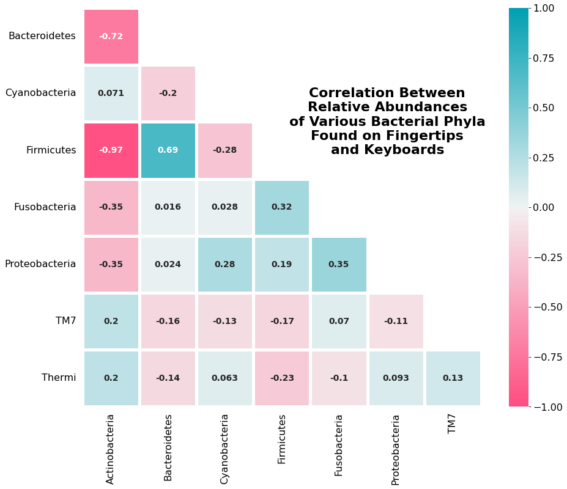
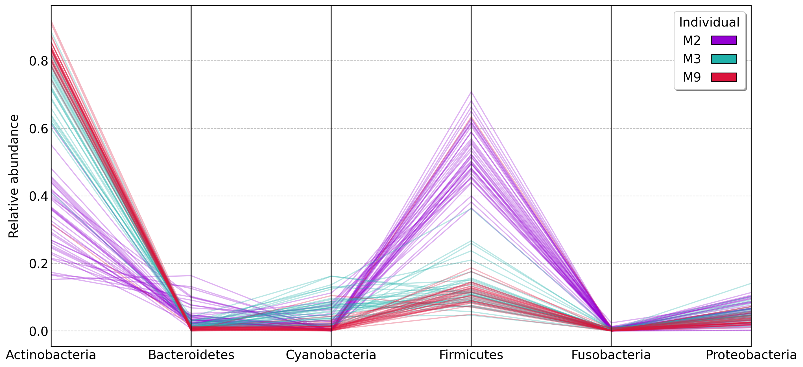
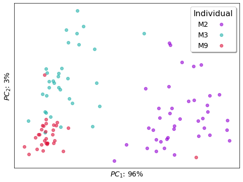
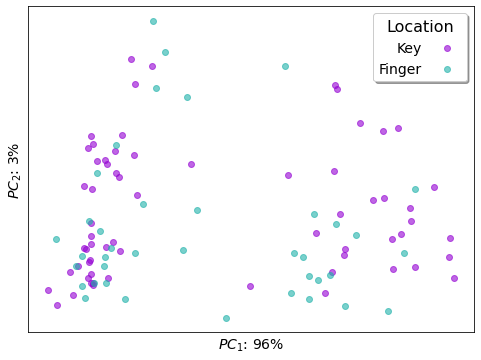

# Microbe Data Analysis

Data is adapted from the publicly available data for the [2010 Fierer et al. paper](https://www.pnas.org/content/107/14/6477)

In this project, we will analyze bacterial phyla that were found on keyboard keys as well as on finger tips. We will also take a look at this data on an individual basis. 

In doing so, we will be trying to answer the following questions:   
* Are some bacterial phyla highly correlated to another bacterial phyla?
* Do bacterial communities found on keyboard keys and fingertips differ on an individual basis?
* Is there a correlation between bacteria found on keyboard keys and on finger tips?

---

<h2 align="center">Are some bacteria highly correlated to another bacterial phyla?</h2>
<h3 align="center">
<b>Plot 1:</b> Heatmap that shows the correlations between the relative abundances of the different Phyla
</h3>

We can see a significant positive correlation between the <i>Bacteroidetes</i> and <i>Firmucites</i> as well as a strong negative correlation between <i>Actinobacteria</i> and <i>Firmicutes</i>

---

<h2 align="center">Do bacterial communities found on keyboard keys and fingertips differ on an individual basis?</h2>
<h3 align="center">
<b>Plot 2:</b> Parallel coordinates plot to show how phylum abundances vary between individuals
</h3>

We can see see that individuals M3 and M9 are fairly similar, while individual M2 has a significantly different bacterial ecosystem

---

<h2 align="center";>Do bacterial communities found on keyboard keys and fingertips differ from one individual to another?</h2>
<h3 align="center";>
<b>Plot 3:</b> 2D scatterplot showing observations using PCA with colors to distinguish each of the three individuals    
</h3>

We can see that there are 3 mostly distinct groups differing by individual. We can also see that the individual M2 is much more different than the other individuals, but that there is still some significant difference between individuals M3 and M9 as well.

---

<h2 align="center";>Is there a correlation between bacteria found on keyboard keys and on finger tips?</h2>
Now, instead of looking at the bacteria by individual, we want to see if there are differences between the bacteria found on keyboard keys and on finger tips.

<h3 align="center";>
<b>Plot 4:</b>2D scatterplot showing observations using PCA with colors to distinguish sample locations
</h3>

We can see that no distinct groups of bacteria were found on keyboard keys and on finger tips, implying that the bacteria found on keyboard keys and on finger tips are largely the same.
 
 

We can also take a look at using TSNE instead of PCA as a different form of dimensionality reduction to see if there is a difference in the bacteria found on keyboard keys and on finger tips. In this case, we will look specifically at individual M3

<h3 align="center";>
<b>Plot 5:</b>2D scatterplot showing all of the observations using TSNE with colors to distinguish sample locations
</h3>

Once again, no distinct groups are found, implying that the bacteria found on keyboard keys and on finger tips are likely one and the same. 

