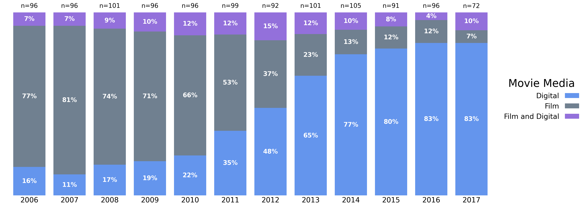
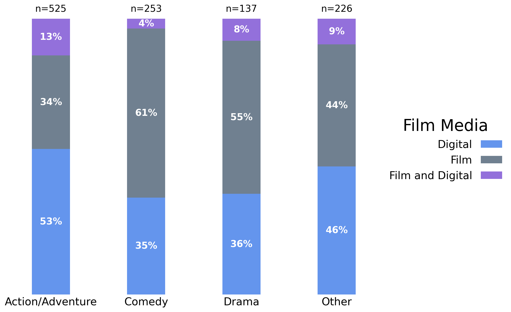
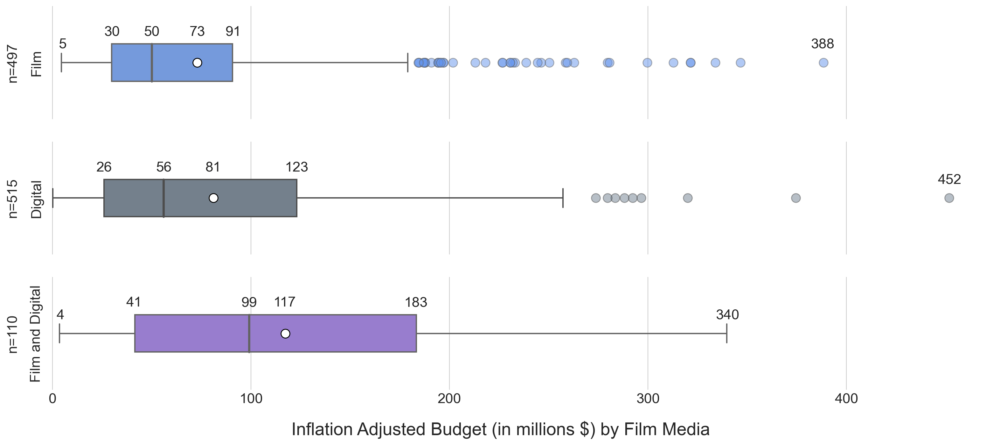

# Movie Data Analysis

In this project, we will analyze movie data, specifically the film media (e.g. film vs. digital), the genre, and the budget.

In doing so, we will be trying to answer the following questions:
* How has the distribution of film media changed over time? 
* How has the distribution of genres changed over time?
* Does movie genre dictate film media?
* What are the distributions of budgets of each film media?

---

<h2 align="center">How has the distribution of film media changed over time?</h2>
<h3 align="center">
<b>Plot 1:</b> Stacked bar chart of the distribution of film media over time from 2006-2017.
</h3>

We can see that back in 2006, the predominant movie medium was film and that film remained the primary medium up until 2012. After that, digital media took over by storm, and is used for the vast majority of movies in recent years. 

---

<h2 align="center">How has the distribution of genres changed over time?</h2>
<h3 align="center">
<b>Plot 2:</b> Stacked bar chart of the distribution of movie genre over time from 2006-2017.
</h3>

We can see that there while action/adventure movies have always been the most common, they have picked up even more popularity in recent years. There is also an observable decline in the number of comedy movies with time, while dramas and other genres have remained generally stable. 

---

<h2 align="center">Does movie genre dictate film media?</h2>
<h3 align="center">
<b>Plot 3:</b>Stacked bar chart of the relative frequency of film media by movie genre.
</h3>

We can see that it is action/adventure movies that use the digital medium most often, while comedies and ramas tend to make use of film more often. Understanding this data along with our previous visualizations, we can see that the decline in the usage of the film medium in recent years could also be due to the decline in comedy movies, which are primarily created using film. Meanwhile, the recent popularity of action/adventure movies⁠—which are primarily created using digital media⁠—could explain the recent rise in the usage of the digital medium. 

---

<h2 align="center">What are the distributions of budgets of each film media?</h2>
<h3 align="center">
<b>Plot 4:</b>Boxplots of the distribution of budgets for each film media.
</h3>

We can see that the combination of film and digital tends to make a movie more expensive, while movies in film tend to run the cheapest. We can also see that there are some outliers for this data, such as the most expensive movie being a digital movie with a budget of about $452 million. Also, there are quite a few outliers for film movies, so even though film movies tend to be the least expensive, this is not always the case. 
