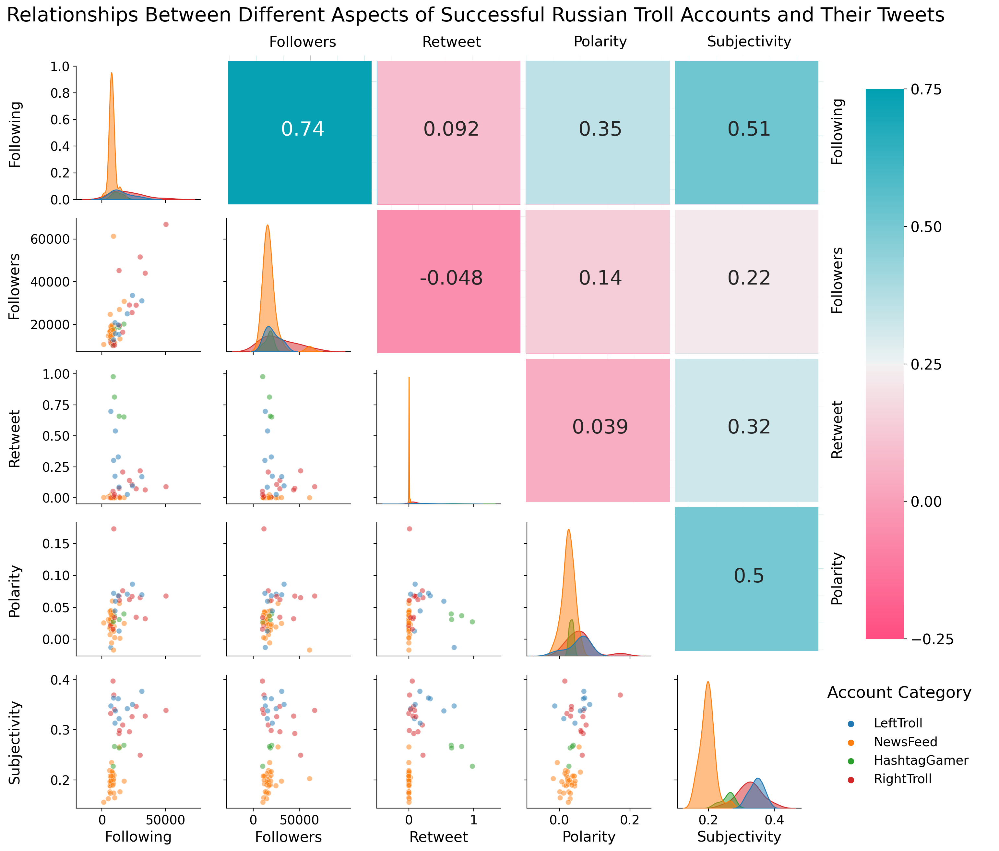
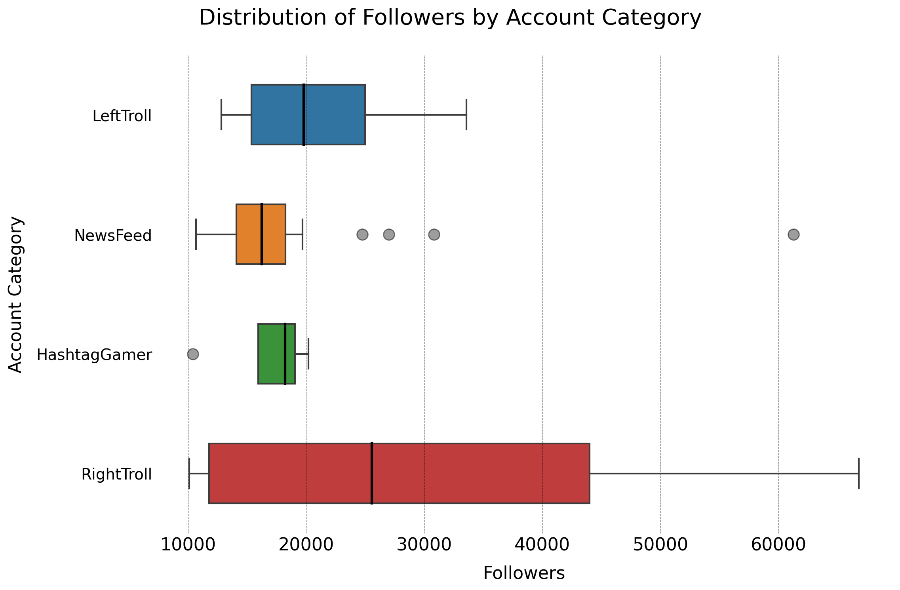
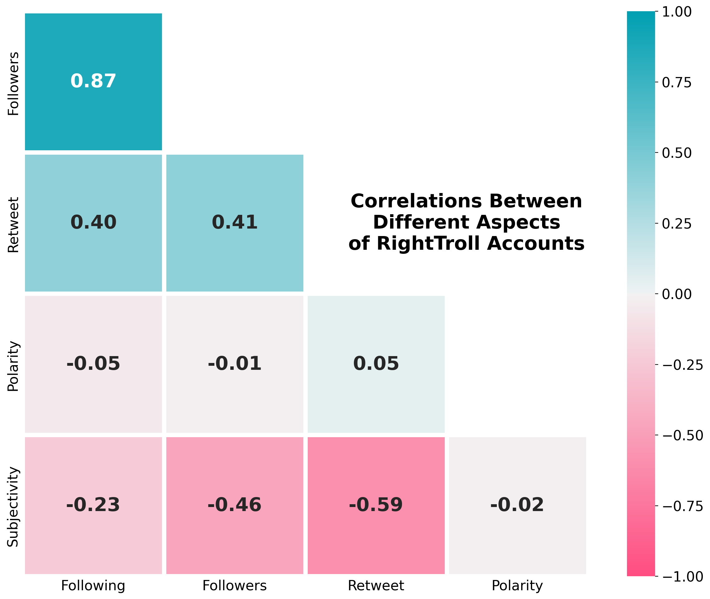
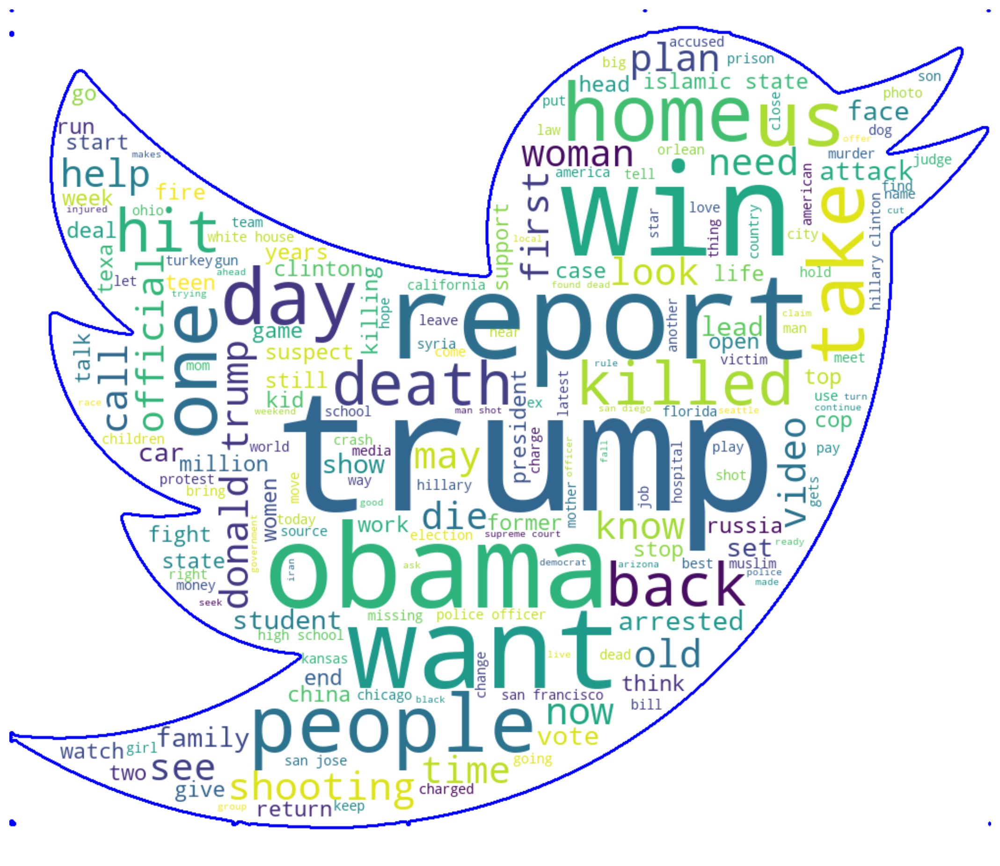

# Russian Troll Tweet Analysis

In this project, we will analyze Russian troll tweet data from the dataset provided by [fivethirtyeight](https://github.com/fivethirtyeight/russian-troll-tweets/).  
[Some analysis](http://pwarren.people.clemson.edu/Linvill_Warren_TrollFactory.pdf) of this data has already been completed and published by Linvill and Warren of Clemson university.

In this analysis, we will be trying to answer one primary question:  
**What characteristics of troll accounts and their tweets make them successful?**

In this case, we are equating success to the number of followers the troll account has, as a higher follower account will allow the troll to spread their message to a greater number of individuals. 

As we answer this question, we will be answering some secondary questions that will help guide our answer, such as:
* Which account category is most successful?
* What are some specific characteristics of the most successful account category?
* What type of language are the top troll accounts using?

---

<h2 align="center">What characteristics of troll accounts and their tweets make them successful?</h2>
<h3 align="center">
<b>Plot 1:</b> Relationships between different aspects of successful Russian troll accounts and their tweets
</h3>

````{div} full-width

````

This is a very rich plot and it reveals to us many aspects of the successful troll accounts and tweets. Starting off with the heatmap, we can analyze linear correlations between some of the features, and we can see how they relate to one another. We see that the strongest positive correlation is between 'Followers' and 'Following' which suggests that as the troll accounts followed more people, they would have more followers themselves, and therefore a larger reach. This principle is observable on many different social media, where bot accounts tend to send out follow requests en masse in the hopes that they will get more followers themselves, which establishes some sort of legitimacy and a greater reach.  
With the scatterplots and KDE plots, we can analyze any non-linear relationships and any grouping that occurs by group category. For example, we can see that the 'NewsFeed' accounts tend to send fairly neutral tweets in terms of polarity and subjectivity, while the political accounts of 'LeftTrolls' and 'RightTrolls' tend to send tweets that are more subjective and polar. 

---

<h2 align="center">Which account category is most successful?</h2>
<h3 align="center">
<b>Plot 2:</b> Boxplots showing distributions of followers by account category
</h3>

````{div} full-width

````

We can see that troll accounts classified as 'RightTrolls' have the greatest number of successful accounts on average, followed by the 'LeftTrolls'. Of course, while on average this is true, there is a signficant range of followers for the 'RightTroll' accounts, and some outliers for the 'NewsFeed' accounts are quite large as well. 

---

<h2 align="center">What are some specific characteristics of the most successful account category?</h2>
<h3 align="center">
<b>Plot 3:</b> Heatmap showing correlations between characteristics of successful RightTroll accounts
</h3>

````{div} full-width

````
We can see that the 'RightTrolls' have an even greater positive correlation between 'Following' and 'Followers', strongly implying that there is a linear relationship between the two variables. We can also observe that 'Polarity' seems to have a neutral correlation with the success of the 'RightTrolls', while 'Subjectivity' actually has a moderate negative correlation with the follower count. 

---

<h2 align="center">What type of language are the top troll accounts using?</h2>
<h3 align="center">
<b>Plot 4:</b> Wordcloud of the top words used by successful troll accounts. 
</h3>

````{div} full-width

````
We can see that a big focus of tweets sent out or retweeted by the successful troll accounts was political. With 'trump' being the single most common word and 'obama' being up there too, there was a big focus on US presidents in their tweets. Beyond that, some divisive language was very common, such as 'death', 'murder', 'attack', 'shooting', and 'killed'. In general, this language could potentially serve to bring about quarreling and incite fear among those who read these tweets.  

